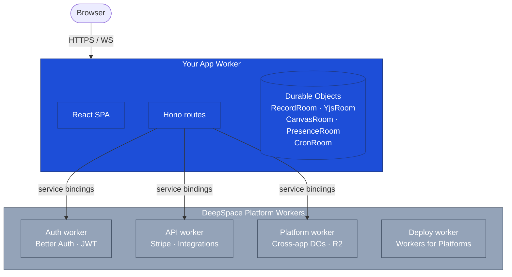

A DeepSpace app is a normal Cloudflare Worker. It serves your React SPA, exposes API routes, and owns a set of Durable Objects that hold per-app data. Around your worker, the DeepSpace platform runs a handful of shared services — authentication, payments, integrations, and cross-app data — that your worker talks to over service bindings or HTTPS.

## The pieces



You write and deploy the **App Worker** (in blue above). The platform workers are operated by DeepSpace; your worker talks to them via service bindings (preferred) or HTTPS URLs (fallback for local dev). You never deploy or manage the platform workers — they're shared infrastructure.

## Your worker

The scaffolded worker is a Hono app that handles four classes of request:

| Route | What it serves |
|---|---|
| `GET /ws/:roomId` (and variants) | WebSocket upgrades for Durable Object rooms — records, Yjs, canvas, presence, cron |
| `GET/POST /api/auth/*` | Proxied to the platform's auth worker |
| `GET/POST /api/integrations/*` | Proxied to the platform's API worker |
| `POST /api/actions/:name` | Server actions defined in `src/actions/index.ts` |
| `POST /api/ai/chat` | Streamed AI chat (defined in `src/ai/chat-routes.ts`) |
| Everything else | Static SPA assets (the Vite build output) |

The worker runs on Cloudflare Workers for Platforms, which means each deployed app is isolated in its own namespace. Your app's URL is `<wrangler.toml name>.app.space`.

## Durable Objects

State that needs to be **shared** — across users, across tabs, in real time — lives in a Durable Object. The scaffold ships five DO classes; each is an SDK base class subclassed in `worker.ts`:

| Class | Purpose | WebSocket route |
|---|---|---|
| `RecordRoom` | SQLite-backed records (your collections) | `/ws/:roomId` |
| `YjsRoom` | Per-document Yjs CRDT state | `/ws/yjs/:docId` |
| `CanvasRoom` | Collaborative canvas shapes + viewports | `/ws/canvas/:docId` |
| `PresenceRoom` | Cursors, typing indicators, viewports | `/ws/presence/:scopeId` |
| `CronRoom` | Scheduled task scheduler + history | `/ws/cron/:roomId` |

You can add more (such as `GameRoom` for turn-based games) or subclass any of them with custom behavior.

Each DO is keyed by a **scope ID** — the room name. Different scope IDs mean different DO instances with separate state.

## Scopes

A scope is a namespaced identifier that determines which DO instance you're talking to.

| Scope | What it represents | Hosted on |
|---|---|---|
| `app:<APP_NAME>` | Your app's main RecordRoom — everything tied to the app | Your worker |
| `conv:<id>` | A DM or group conversation DO | Your worker |
| `workspace:default` | Cross-app shared scope (shared user identity) | Platform worker |
| `dir:<appHandle>` | Cross-app directory (conversations, communities, posts) | Platform worker |

The default in the scaffold is `app:<APP_NAME>`, exported as `SCOPE_ID` from `src/constants.ts`. Your `RecordScope` provider mounts this scope; `useQuery` / `useMutations` operate against it.

To read or write a cross-app scope, see [Cross-app shared scopes](#cross-app-shared-scopes) below.

## Platform workers

You don't deploy these. The SDK and CLI talk to them on your behalf.

| Worker | Responsibility |
|---|---|
| **Auth worker** | Better Auth integration, OAuth flows, JWT issuance (ES256, 5-minute lifetime) |
| **API worker** | Stripe billing, integration proxy, user profiles, OAuth token storage, usage tracking |
| **Platform worker** | Shared Durable Objects for `workspace:*`, `dir:*`, `conv:*`; R2 file gateway |
| **Deploy worker** | Receives `deepspace deploy` uploads; provisions custom bindings; manages subdomains |
| **Dispatch worker** | Routes `*.app.space` traffic to the right deployed app |

The scaffold's `worker.ts` proxies to these via helper functions from `deepspace/worker`:

```ts
import { authWorkerFetch, apiWorkerFetch, platformWorkerFetch } from 'deepspace/worker'
```

These helpers prefer service bindings (set up automatically on deploy) and fall back to HTTPS URLs in local dev.

## Security model — WebSocket identity

Your Durable Object trusts the identity passed to it. The worker is the only place to scrub spoofed claims, so the SDK enforces two layers of scrubbing:

**Per-app WebSocket route (`wsRoute`)** — strips `userId`, `userName`, `userEmail`, `userImageUrl`, `role`, and `token` from the URL on every upgrade, then re-applies identity only from a verified JWT. Three states are possible:

- **No token** → anonymous (DO assigns `anon-<uuid>`)
- **Invalid token** → 401
- **Valid token** → identity = JWT `sub` / `name` / `email` / `image`

**Platform worker `/api/*` passthrough** — same scrubbing for WebSocket upgrades, plus overwriting `X-User-Id` and stripping `X-App-Action` on HTTP forwards. Cross-app scopes (`workspace:*`, `dir:*`, `conv:*`) require a valid JWT — no anonymous access.

<Warning>
**Never put identity in WebSocket URLs or `/api/*` headers.** The starter `wsRoute` strips them; identity always comes from the JWT subject. There is no client-side override.
</Warning>

## Cross-app shared scopes

If your app needs to read or write `workspace:*`, `dir:*`, or `conv:*` scopes that sync across DeepSpace apps, two edits are required.

<Steps>
  <Step title="Declare the platform service binding">
    Add this to `wrangler.toml`:

    ```toml
    [[services]]
    binding = "PLATFORM_WORKER"
    service = "deepspace-platform"
    ```
  </Step>

  <Step title="Proxy shared scopes in worker.ts">
    Replace the default `wsRoute` with a small router:

    ```ts
    import { platformWorkerFetch } from 'deepspace/worker'

    app.get('/ws/:roomId', async (c) => {
      const roomId = c.req.param('roomId')
      if (/^(workspace|dir|conv):/.test(roomId)) {
        return platformWorkerFetch(c.env, c.req.raw)
      }
      return wsRoute((env) => env.RECORD_ROOMS)(c)
    })
    ```
  </Step>

  <Step title="Mount the shared scope in your provider tree">
    ```tsx
    <RecordScope
      roomId={SCOPE_ID}
      schemas={schemas}
      appId={APP_NAME}
      sharedScopes={[{ roomId: 'workspace:default', schemas: WORKSPACE_SCHEMAS }]}
    >
      <App />
    </RecordScope>
    ```
  </Step>
</Steps>

Without all three edits, `sharedScopes` writes to your app's own DO instead of the platform's shared DO, and cross-app data won't show up.

## Build & deploy pipeline

`npx deepspace deploy` performs these steps in order:

<Steps>
  <Step title="Build the frontend">
    `vite build` outputs static assets and a normalized `config.json`.
  </Step>
  <Step title="Build the worker">
    esbuild bundles `worker.ts` with the SDK and your custom code.
  </Step>
  <Step title="Validate the binding manifest">
    `validateBindingManifest` checks `wrangler.toml` against allowed types and reserved names.
  </Step>
  <Step title="Auto-provision resources">
    Any binding with `id = "auto"` (or `bucket_name = "auto"`, etc.) is created on the platform Cloudflare account on first deploy.
  </Step>
  <Step title="Upload to Workers for Platforms">
    The worker is registered in the platform's dispatch namespace.
  </Step>
  <Step title="Sync user secrets">
    Keys in `.dev.vars` (below the SDK-managed divider) become `secret_text` bindings on the deployed worker.
  </Step>
  <Step title="Register the subdomain">
    The `name` in `wrangler.toml` becomes `<name>.app.space`. The dispatch worker routes incoming traffic to your worker's isolate.
  </Step>
</Steps>

## Next

<CardGroup cols={2}>
  <Card title="Data model" icon="database" href="/concepts/data-model">
    Collections, records, and how data is shaped.
  </Card>
  <Card title="Permissions" icon="lock" href="/concepts/permissions">
    Role-based access control on collections.
  </Card>
  <Card title="Real-time sync" icon="bolt" href="/concepts/realtime-sync">
    How WebSocket sync works under the hood.
  </Card>
  <Card title="Deployment" icon="cloud-arrow-up" href="/concepts/deployment">
    What happens when you run `deploy`.
  </Card>
</CardGroup>
